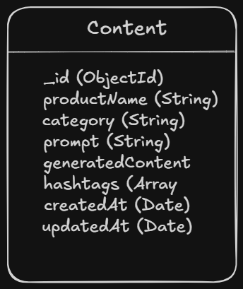

# AI Marketing Content Generator for Food Processing Businesses

## Project Overview

AI Marketing Content Generator is a full-stack web application designed to help food processing businesses create professional and engaging marketing content using Artificial Intelligence. The platform enables users to provide product information through structured forms, voice input, or an AI-powered chatbot and generates marketing materials tailored for digital platforms.

The goal of the project is to assist small and medium-scale food businesses in improving their online presence, reducing content creation effort, and enhancing product promotion through AI-driven solutions.

---

# Problem Statement

Many food processing businesses struggle to create effective marketing content for their products due to limited marketing expertise, time constraints, and lack of digital tools.

This project aims to simplify content creation by leveraging Artificial Intelligence to automatically generate high-quality marketing content from basic product information.

---

# Key Features

## 1. Product Information Form

Users can enter product details such as:

* Product Name
* Ingredients
* Weight
* Product Category
* Key Features

## 2. AI Marketing Assistant Chatbot

* Conversational interface for collecting product information.
* Assists users in generating marketing content through natural language interaction.

## 3. Voice-to-Text Product Input

* Users can describe products using voice input.
* Speech is automatically converted into text for processing.

## 4. AI Content Generation

Generate:

* Product Descriptions
* Promotional Content
* Social Media Captions

## 5. Hashtag & Tagline Generator

* Generates relevant hashtags for social media.
* Creates marketing taglines for branding and promotions.

## 6. Content History Management

* Stores generated marketing content in MongoDB Atlas.
* View, search, update, and delete previously generated marketing content.

---

# System Workflow

1. User enters product details through form, chatbot, or voice input.
2. Product information is processed by the backend.
3. Marketing content is generated based on the provided product information.
4. Generated content is displayed to the user.
5. The generated content is permanently stored in MongoDB Atlas for future reference.

---

# Expected Outcomes

* Faster content creation process
* Improved digital marketing support for food businesses
* User-friendly AI-powered marketing assistant
* Enhanced product visibility through optimized marketing content
* Persistent cloud-based storage of generated marketing content

---

# Technologies Used

## Frontend

* React.js
* Tailwind CSS
* Axios
* React Router

## Backend

* Node.js
* Express.js
* MongoDB Atlas
* Mongoose
* CORS
* Dotenv

---

# Database Choice

This project uses **MongoDB Atlas** as its cloud-hosted NoSQL database.

MongoDB Atlas was chosen because marketing content is naturally document-oriented and flexible. It efficiently stores product details, prompts, generated marketing content, hashtags, and timestamps without requiring a rigid relational schema.

---

# Database Schema

The application currently contains one primary entity.

## Content Collection

The application stores marketing content in a MongoDB collection named **Content**.

| Field | Data Type | Description |
|--------|-----------|-------------|
| _id | ObjectId | Unique identifier generated by MongoDB |
| productName | String | Name of the product |
| category | String | Product category |
| prompt | String | Prompt provided by the user |
| generatedContent | String | Generated marketing content |
| hashtags | Array<String> | List of generated hashtags |
| createdAt | Date | Timestamp when the document was created |
| updatedAt | Date | Timestamp when the document was last updated |

### Schema Diagram

> **Week 5 Schema Diagram**



---

# API Endpoints

| Method | Endpoint                 | Description                  |
| ------ | ------------------------ | ---------------------------- |
| GET    | `/api/content`           | Get all marketing content    |
| GET    | `/api/content/:id`       | Get content by ID            |
| POST   | `/api/content`           | Create new marketing content |
| PUT    | `/api/content/:id`       | Update existing content      |
| DELETE | `/api/content/:id`       | Delete marketing content     |
| GET    | `/api/content/search?q=` | Search marketing content     |

---

# Environment Variables

Create a `.env` file inside the **backend** folder.

```env
PORT=5000

MONGO_URI=your_mongodb_connection_string
```

Also include a `.env.example` file in the repository:

```env
PORT=5000

MONGO_URI=your_mongodb_connection_string
```

---

# How to Run the Project Locally

## 1. Clone the Repository

```bash
git clone https://github.com/CMRAN-SIMMI/AI-Marketing-Content-Generator.git
```

---

## 2. Navigate to the Backend Folder

```bash
cd backend
```

---

## 3. Install Backend Dependencies

```bash
npm install
```

---

## 4. Configure Environment Variables

Create a `.env` file inside the backend folder.

```env
PORT=5000

MONGO_URI=your_mongodb_connection_string
```

---

## 5. Start the Backend Server

```bash
npm run dev
```

Backend runs at:

```
http://localhost:5000
```

---

## 6. Navigate to the Frontend 

Open another terminal.

---

## 7. Install Frontend Dependencies

```bash
npm install
```

---

## 8. Start the Frontend

```bash
npm run dev
```

Frontend runs at:

```
http://localhost:5173
```

---

# Project Structure

```
AI-Marketing-Content-Generator
│
├── backend
│   ├── controllers
│   ├── models
│   ├── routes
│   ├── data
│   ├── .env
│   ├── .env.example
│   └── server.js
│
└── README.md
```

---

# Future Enhancements

* OpenAI API Integration
* User Authentication
* Content Analytics Dashboard
* Multi-language Marketing Content Generation
* Image Generation Support
* Export Generated Content as PDF

---

# Author

**Simran**

AI-Assisted Full Stack Web Development Internship Project
